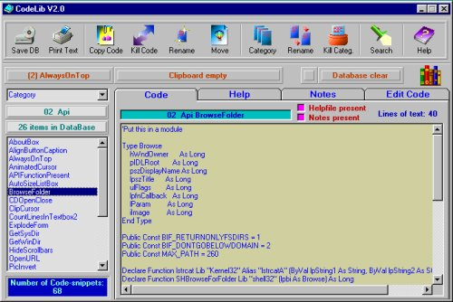



## CodeLib V2

### Description

A long time I hesitated about submitting this or not. Finally I made up my mind. The CodeLib V2 is a database-kind of program that stores codesnippets,functions and subs to make programming easier. There's taken care of the layout of the forms, and it uses my award winning T3D-function a lot, together with other stuff I developped, such as my MBox (alternative messagebox) and IBox (alternative InputBox). The result is very good, I might say.

Anyway, to make a long story short: Select a code, function or sub, put it on the clipboard (with a button !), go to your VB-project and paste (ctrl/V) the code where you want it. Created a new reusable code ? Start up the CodeLib V2 and add it to the database. Want to replace a certain code with a better one ?

Want to rename a code ? Want to move a code to a different category ? Want to delete a code ? Want to add a help-file ? Want to add some notes to a code ? Want to EDIT a code ? Want to print the code ? Want to print the helpfile ? Want to ... As you can see, this is a fully working program that I use a lot when I'm coding. The CodeLib V2 (zip) is about 223 kb, but it has it all: the source, CodeLibV2.exe, data (about 70 different codes, all tested and working fine). I hope

you're as thrilled about this as I am. And I don't want to receive mail like "this sucks" or "the worst thing I ever seen", etc... This is GOOD CODE ! It works fine for me (VB6 enterprise edition) and I didn't found any bugs so far. The helpfile can be read with notepad, but will also be loaded in the program. In the helpfile, you have a small button "send mail". This will start up your e-mail prog and link directly to me. Do it ! A final note: this isn't a database prog like acces, or works with ADO, all code is stored in a sequential file, wich is loaded directly into memory. This works very fast. Extract the zip to C:\ or any folder of your choice

and voila ! Happy coding...
 
### More Info
 

             |
---                |---
**Submitted On**   |2000-04-30 02:47:42
**By**             |[stephane swertvaegher](https://github.com/Planet-Source-Code/PSCIndex/blob/master/ByAuthor/stephane-swertvaegher.md)
**Level**          |Intermediate
**User Rating**    |4.9 (364 globes from 74 users)
**Compatibility**  |VB 5\.0, VB 6\.0
**Category**       |[Complete Applications](https://github.com/Planet-Source-Code/PSCIndex/blob/master/ByCategory/complete-applications__1-27.md)
**World**          |[Visual Basic](https://github.com/Planet-Source-Code/PSCIndex/blob/master/ByWorld/visual-basic.md)
**Archive File**   |[CODE\_UPLOAD53704302000\.zip](https://github.com/Planet-Source-Code/stephane-swertvaegher-codelib-v2__1-7715/archive/master.zip)

